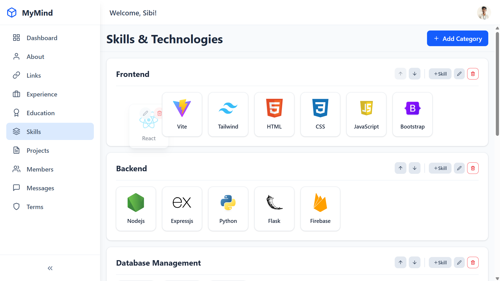
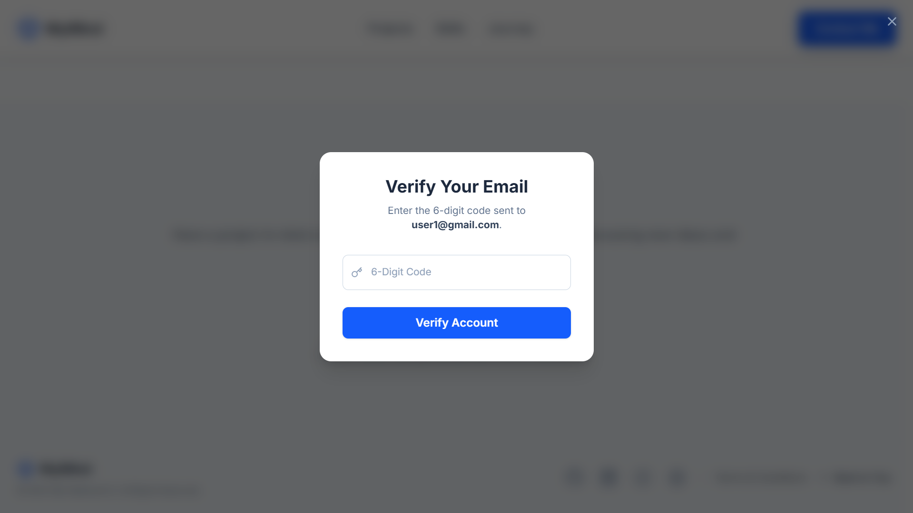

<!-- <p align="center">
  
</p> -->

<h1 align="center"><strong>MyMind: A Full-Stack Portfolio & Headless CMS</strong></h1>

<p align="center">
  <em>A personal portfolio doesn't have to be static. This is a living showcase, fully managed by a custom-built, secure content management system.</em>
</p>

<p align="center">
  <a href="https://sibisiddharth.me" target="_blank">
    
  </a>
  &nbsp;
  <a href="https://admin.sibisiddharth.me" target="_blank">
    
  </a>
</p>

---

### 📖 The Story

As a developer, I found that updating my portfolio was a chore. Every new project or skill meant diving back into the code. I wanted a better way—a system where my portfolio would be as dynamic and easy to update as a blog post.

So, I built the solution. **MyMind** is a complete full-stack application that separates content from presentation. The public portfolio is a beautiful, performant React application, but its true power lies in the engine running behind it: a secure, custom-built headless CMS.

---

### ✨ The Magic in Action

#### 🧠 Effortless Content Management
Update skills, reorder categories, and manage projects with a user-friendly drag-and-drop interface. Changes made in the admin panel are reflected on the live portfolio instantly.

<p align="center">
  
</p>

#### 💫 A Polished Visitor Experience
The public portfolio is built with modern UI/UX principles, including lazy-loading content, fluid animations with Framer Motion, and a secure, OTP-verified system for sending messages.

<p align="center">
  
</p>

---

### 🛠️ The Toolkit

This project utilizes a modern, robust, and scalable technology stack from end to end.

<p align="center">
  <!-- Frontend -->
  <div align="center">
  
  
  
  
  
  
  
  
  </div>

  <br/>

  <!-- Backend -->
  <div align="center">
  
  
  
  
  
  
  </div>

  <br/>

  <!-- Infra & Deployment -->
  <div align="center">
  
  
  
  
  
  
  </div>
</p>

---

### 🔒 Explore the Engine

To maintain security and follow industry best practices, the backend and admin panel code are held in a **private repository**.

This engine is the most complex part of the project, featuring:
- A complete REST API
- Dual JWT authentication systems
- File upload and image handling
- Over 10 interconnected data models

I am incredibly passionate about backend systems and would be happy to provide a private walkthrough during interviews.

---

### ⚙️ Get it Running

To run the **public-facing portfolio frontend** locally:

```bash
git clone https://github.com/sibisiddharth8/your-repo-name.git
cd your-repo-name
npm install
```

🧪 Create a .env file in the root directory:

```bash
VITE_API_BASE_URL=https://api.sibisiddharth.me/api
```

🔐 This is your deployed backend API.
If you're running a local backend, you can update it to:
http://localhost:3001/api

Then start the development server:

```bash
npm run dev
```
